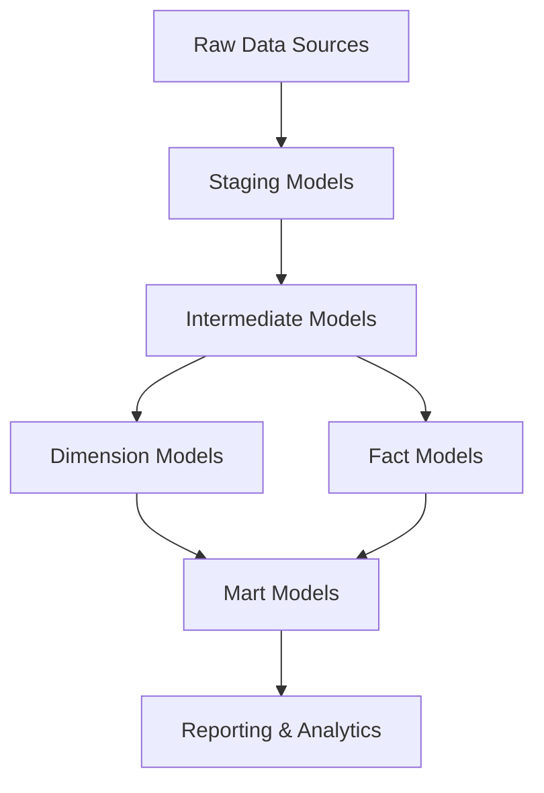

# E-commerce Analytics dbt Project

A dbt (data build tool) project for transforming e-commerce data into analytics-ready models. This project is configured for Google BigQuery and includes example models for e-commerce analytics.

## Project Overview

This dbt project transforms raw e-commerce data into a dimensional model optimized for analytics and reporting. The project follows a layered architecture:

1. **Source Layer**: Raw data from operational systems
2. **Staging Layer**: Cleaned and standardized data
3. **Intermediate Layer**: Business logic and transformations
4. **Dimensional Layer**: Fact and dimension tables in a star schema
5. **Mart Layer**: Business-specific reporting models

## Data Model

The data model is designed around the following core entities:

- **Customers**: Customer information and behavior
- **Products**: Product catalog and hierarchy
- **Orders**: Order transactions and line items
- **Inventory**: Product inventory levels
- **Marketing**: Marketing campaigns and performance

The model follows the Kimball dimensional modeling approach with fact and dimension tables organized in a star schema.



## Key Features

- **BigQuery Optimizations**: Configured for optimal performance on BigQuery
- **Incremental Models**: Efficient processing of large fact tables
- **Data Quality Tests**: Comprehensive tests for data validation
- **Documentation**: Detailed documentation of models and business logic
- **Reusable Macros**: Common calculations and utilities
- **Example Analyses**: Sample analytical queries

## Getting Started

### Prerequisites

- dbt CLI installed (version 1.0.0 or later)
- Access to a BigQuery instance
- Python 3.8 or later

### Installation

1. Clone this repository:
   ```bash
   git clone https://github.com/your-organization/ecommerce-analytics.git
   cd ecommerce-analytics
   ```

2. Install dependencies:
   ```bash
   pip install -r requirements.txt
   ```

3. Set up your BigQuery credentials in `~/.dbt/profiles.yml`:
   ```yaml
   ecommerce_analytics:
     target: dev
     outputs:
       dev:
         type: bigquery
         method: oauth
         project: your-gcp-project-id
         dataset: ecommerce_analytics_dev
         threads: 4
         timeout_seconds: 300
         location: US
   ```

### Running the Project

1. Build all models:
   ```bash
   dbt build
   ```

2. Run specific models:
   ```bash
   dbt run --select staging
   dbt run --select marts.marketing
   ```

3. Test the models:
   ```bash
   dbt test
   ```

4. Generate documentation:
   ```bash
   dbt docs generate
   dbt docs serve
   ```

## Project Structure

```
ecommerce_analytics/
├── analyses/                    # Ad-hoc analytical queries
│   ├── customers/               # Customer analyses
│   ├── products/                # Product analyses
│   ├── sales/                   # Sales analyses
│   └── marketing/               # Marketing analyses
├── macros/                      # Reusable SQL snippets
│   ├── utils/                   # Utility macros
│   ├── business_logic/          # Business logic macros
│   └── bigquery/                # BigQuery-specific macros
├── models/                      # Data transformation logic
│   ├── staging/                 # Minimal transformations from raw data
│   │   └── sources.yml          # Source definitions
│   ├── intermediate/            # Business logic transformations
│   ├── dimensions/              # Dimension tables
│   ├── facts/                   # Fact tables
│   └── marts/                   # Business-specific reporting models
│       ├── marketing/           # Marketing-specific models
│       ├── sales/               # Sales-specific models
│       └── customers/           # Customer-specific models
├── seeds/                       # Static reference data
│   ├── country_codes.csv        # Country reference data
│   └── product_categories.csv   # Product category hierarchy
├── snapshots/                   # Slowly changing dimension logic
├── tests/                       # Custom data tests
│   ├── generic/                 # Generic test definitions
│   └── singular/                # Singular test queries
├── dbt_project.yml              # Project configuration
├── packages.yml                 # External dependencies
└── README.md                    # Project documentation
```

## Data Sources

This project expects the following raw data sources in BigQuery:

- `raw_data.customers`: Customer information
- `raw_data.products`: Product catalog
- `raw_data.product_categories`: Product category hierarchy
- `raw_data.orders`: Order header information
- `raw_data.order_items`: Order line items
- `raw_data.inventory`: Product inventory levels
- `raw_data.marketing_campaigns`: Marketing campaign information
- `raw_data.website_events`: Website user interaction events

## Key Models

### Staging Models

- `stg_customers`: Cleaned customer data
- `stg_products`: Cleaned product data
- `stg_orders`: Cleaned order data
- `stg_order_items`: Cleaned order item data
- `stg_website_events`: Cleaned website event data

### Intermediate Models

- `int_customer_orders`: Customer order metrics
- `int_order_items_detail`: Detailed order item information
- `int_product_order_metrics`: Product performance metrics
- `int_customer_website_activity`: Customer website activity metrics
- `int_marketing_campaign_performance`: Marketing campaign performance metrics

### Dimension Models

- `dim_customers`: Customer dimension with attributes and metrics
- `dim_products`: Product dimension with attributes and metrics
- `dim_dates`: Date dimension with calendar attributes

### Fact Models

- `fact_orders`: Order fact table at the order header level
- `fact_order_items`: Order items fact table at the line item level
- `fact_website_events`: Website events fact table
- `fact_inventory_snapshots`: Inventory snapshot fact table

### Mart Models

- `mart_campaign_performance`: Marketing campaign performance metrics
- `mart_sales_overview`: Sales overview metrics by date
- `mart_product_performance`: Product performance metrics
- `mart_customer_overview`: Customer overview with order history
- `mart_customer_cohorts`: Customer cohort analysis

## Testing Strategy

This project includes several types of tests:

1. **Schema Tests**: Tests for primary keys, foreign keys, and value constraints
2. **Custom Generic Tests**: Reusable tests for common patterns
3. **Singular Tests**: Custom SQL queries that validate specific business rules

## Documentation

Comprehensive documentation is available for all models, including:

1. **Model Descriptions**: Purpose and usage of each model
2. **Column Descriptions**: Business definitions for each column
3. **Lineage Diagrams**: Visual representation of model dependencies
4. **Business Logic**: Documentation of key business rules and calculations

To view the documentation, run:
```bash
dbt docs generate
dbt docs serve
```

## Contributing

1. Create a new branch for your changes
2. Make your changes following the project conventions
3. Run tests to ensure your changes don't break existing functionality
4. Submit a pull request with a clear description of your changes

## Best Practices

1. **Model Naming**:
   - Use consistent prefixes (`stg_`, `int_`, `dim_`, `fact_`, `mart_`)
   - Use singular nouns for entity names
   - Use descriptive names that indicate the model's purpose

2. **SQL Style**:
   - Use CTEs for readability
   - Comment complex logic
   - Use consistent indentation and formatting

3. **Testing**:
   - Test all primary and foreign keys
   - Test critical business calculations
   - Add custom tests for complex business rules

4. **Documentation**:
   - Document all models and columns
   - Include business context and definitions
   - Keep documentation updated when models change

## License

This project is licensed under the MIT License - see the LICENSE file for details.

## Acknowledgments

- [dbt Labs](https://www.getdbt.com/) for creating dbt
- [dbt Utils](https://github.com/dbt-labs/dbt-utils) for utility macros
- [Kimball Group](https://www.kimballgroup.com/) for dimensional modeling methodology