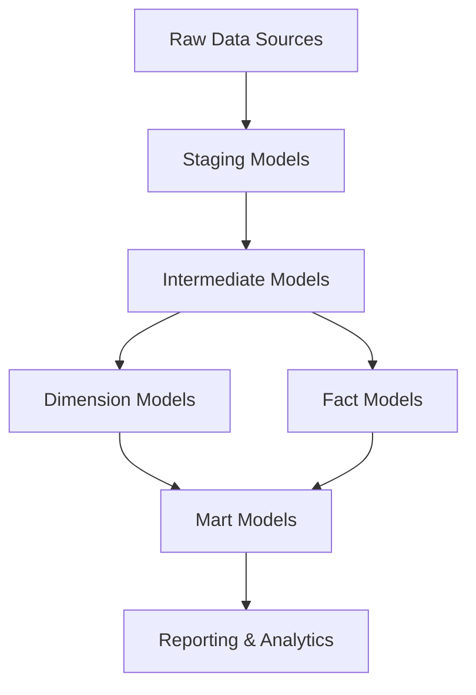

# DBT Project Plan: E-commerce Analytics on BigQuery

## Project Overview
This project will set up a dbt (data build tool) environment configured for Google BigQuery, with example models for e-commerce analytics. The project will follow modern data modeling practices with a layered approach to transform raw e-commerce data into actionable insights.

## Project Structure
The project will follow the standard dbt project structure with additional organization for e-commerce analytics:

```
dbt-mcp-server/
├── analyses/                    # Ad-hoc analytical queries
├── macros/                      # Reusable SQL snippets
├── models/                      # Data transformation logic
│   ├── staging/                 # Minimal transformations from raw data
│   │   └── sources.yml          # Source definitions
│   ├── intermediate/            # Business logic transformations
│   ├── dimensions/              # Dimension tables
│   ├── facts/                   # Fact tables
│   └── marts/                   # Business-specific reporting models
│       └── marketing/           # Marketing-specific models
│       └── sales/               # Sales-specific models
│       └── customers/           # Customer-specific models
├── seeds/                       # Static reference data
├── snapshots/                   # Slowly changing dimension logic
├── tests/                       # Custom data tests
├── dbt_project.yml              # Project configuration
├── packages.yml                 # External dependencies
├── profiles.yml.template        # Connection configuration template
└── README.md                    # Project documentation
```

## Data Flow Architecture



## E-commerce Data Model

The e-commerce data model will include:

### Source Data
- Customers
- Products
- Orders
- Order Items
- Inventory
- Marketing Campaigns
- Website Events

### Key Dimensions
- dim_customers
- dim_products
- dim_dates
- dim_marketing_campaigns

### Key Facts
- fact_orders
- fact_order_items
- fact_inventory_snapshots
- fact_website_events

### Key Metrics
- Customer Lifetime Value
- Product Performance
- Order Conversion Rates
- Marketing Campaign ROI
- Website Funnel Analysis

## Implementation Steps

1. **Create the basic dbt project directory structure**
   - Set up all necessary directories following dbt best practices
   - Organize models directory with staging, intermediate, dimensions, facts, and marts

2. **Set up dbt_project.yml with BigQuery configuration**
   - Configure project name, version, and profile
   - Set up model materialization strategies
   - Configure directory-level configurations

3. **Create profiles.yml template for BigQuery connection**
   - Set up BigQuery-specific connection parameters
   - Include instructions for securely storing credentials

4. **Set up source definitions for e-commerce data**
   - Define all raw data sources in sources.yml
   - Include tests for source data quality
   - Document source tables and columns

5. **Create staging models for raw e-commerce data**
   - Implement minimal transformations from raw data
   - Focus on cleaning, renaming, and type casting
   - Implement source freshness checks

6. **Develop intermediate models for business logic**
   - Implement business logic transformations
   - Create reusable CTEs for common calculations
   - Focus on data normalization and preparation

7. **Build dimensional models (facts and dimensions)**
   - Create dimension tables for entities like customers, products, dates
   - Implement fact tables for transactional data
   - Set up appropriate relationships between facts and dimensions

8. **Create mart models for reporting and analytics**
   - Develop business-specific reporting models
   - Organize by functional areas (marketing, sales, customers)
   - Implement key metrics and KPIs

9. **Set up documentation using dbt docs**
   - Document all models, columns, and tests
   - Create model descriptions and business definitions
   - Set up documentation for metrics and calculations

10. **Create example tests for data quality**
    - Implement schema tests for all models
    - Create custom data tests for business rules
    - Set up test coverage for critical data paths

11. **Set up example macros for reusable SQL**
    - Create utility macros for common operations
    - Implement BigQuery-specific optimizations
    - Set up macros for metric calculations

12. **Create example analyses for ad-hoc queries**
    - Develop sample analytical queries
    - Create example reports and visualizations
    - Implement complex analytical patterns

13. **Set up example seeds for reference data**
    - Create seed files for reference data
    - Implement country codes, product categories, etc.
    - Document seed usage and update procedures

14. **Create README.md with project documentation**
    - Document project setup and configuration
    - Include usage instructions and examples
    - Provide troubleshooting guidance